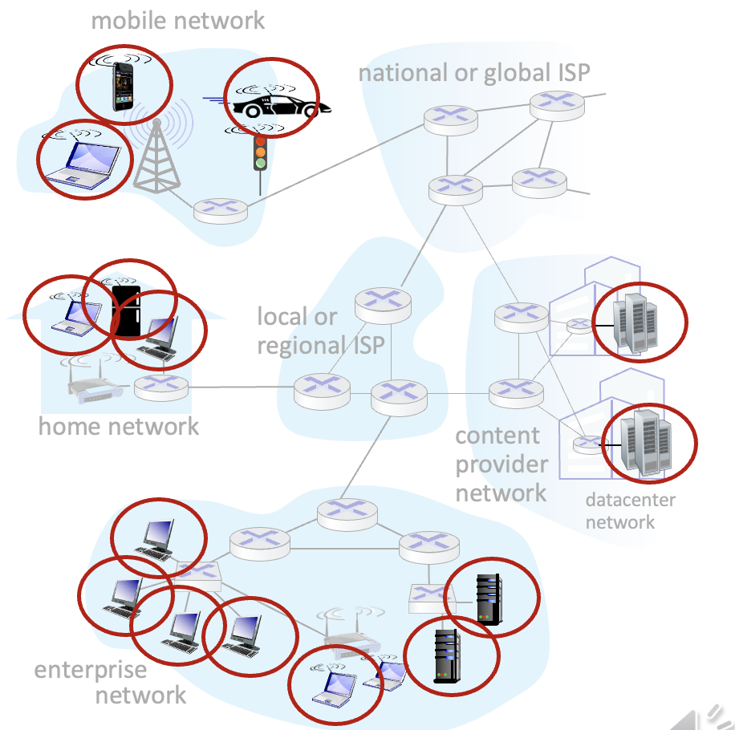

# 计网知识点总结 Week 1

## 1. What is a network
  - Any set of interconnected nodes through horizontal and or vertical lines.
  - 通过平行或者垂直的线，连接起来的节点的集合
  - 有什么样的网络，（除了计网之外的例子）: Telephone network carrying voice traffic, Cable network to disseminate video signals

## 2. 什么是计算机网络？computer network
  - A computer network is a group of computers that use a set of common communication protocols over digital interconnections for the purpose of sharing resources.  
  - 计算机网络是一组计算机，它们通过数字互连使用一套共同的通信协议，以达到共享资源的目的。
  - Set of connected autonomous computers (having programmable hardware) 是一系列自治的，互联的，有可编程硬件的计算机的集合

### 2.1 计网的功能，为什么需要计网
Resource Sharing, Information Sharing, Ease in Communication 资源共享，信息共享，方便沟通

### 2.2 计网的类型
#### 2.2.1 直接连接
- 点对点point to point 就是两台计算机一条线连起来，常用于远程的广域网链接
- 多重连接multiple access 就是多台计算机连接一条总线,通常用于局域网链接

#### 2.2.2 非直接连接
- （用交换机）电路交换，包交换

## 3. 什么是互联网？internet
- The internet is a computer network that interconnects billions of computing devices using communication links and packet switches.
  - 互联网是一个计算机网络，利用通信链路和分组交换机将数十亿的计算设备（称为主机或终端系统）互联起来。
  - 互联网是最为熟知的计算机网络。
  - 有两种不同的描述internet的方法，一种是由组成部件去描述internet，另一种是从提供服务的角度描述internet

### 3.1 a “nuts and bolts” view，具体来看什么是internet
- The basic hardware and software components that make up the Internet.

#### 3.1.1 Devices 
- 主机（hosts） = 终端（end systems）
- running network apps at internet's eges

#### 3.1.2 Packet switches
- 路由器（routers）
- 交换机（switches）

#### 3.1.3 Communication links
- 光纤、铜线、无线电、卫星fiber copper radio satellite 
- 传输速率：带宽

#### 3.1.4 Networks 
- 设备、路由器、链接的集合：由一个组织管理collection of devices, routers, links: managed by an organization

### 3.2 a “service” view
- **因特网是一种基础设施**：为应用程序提供服务的基础设施 Infrastructure that provides services to applications。网络、流媒体视频、多媒体电话会议、电子邮件、游戏、电子商务、社交媒体、相互连接的设备等。
- **因特网提供编程接口**：为分布式应用提供编程接口 provides programming interface to distributed applications:。"钩子 "允许发送/接收应用程序 "连接 "到，使用互联网传输服务。提供服务选项，类似于邮政服务

## 4. 什么是协议？
- Protocols define the format, order of messages sent and received among network entities, and actions taken on msg transmission, receipt
- 协议定义了网络实体之间发送和接收消息的格式、顺序，以及在消息传输和接收时所采取的动作。
- All activity on the Internet that involves two or more communicating remote entities is governed by a protocol.
- 凡是涉及两个或者多个通信实体的所有活动都要受到通信协议的制约。

## 5. 网络边界
### 5.1 网络边缘
- 主机分成客户端和服务端（client and server）
- 服务器（server）通常在数据中心（data center）

### 5.2 网络核心
- routers and switches
- network of networks

---

# Week 9
## 1. 网络层功能
### 1.1 转发（数据平面的功能）
- 将数据包从路由器的输入移动到适当的路由器输出：move packets from router’s input to appropriate router output

### 1.2 路由（控制平面的功能）
- 确定数据包从源到目的地所采用的路径: determine route taken by packets from source to destination

## 2. 控制平面
> 控制平面执行路由的功能（找出一条路），核心就是计算路由表
> 要么是路由器自己计算路由表，要么通过一个外部的远程控制器统一计算路由表
> 路由器和路由器之间可以通过组件进行通信，交换 包含转发表和其他路由选择信息的报文来实现通信。
### 2.1 构建控制平面的两种方法
#### 2.1.1 per-router 每路由器控制
- 每个路由器中的各个路由算法组件在控制平面中相互作用

#### 2.1.2 SDN (software defined network) 软件定义网络控制平面
- 远程控制器计算并在路由器中安装转发

## 3. 路由协议
> 路由协议的目的，确保好的路径
> ”好“代表：最低“成本”，“最快”，“最不拥挤”  “good”: least “cost”, “fastest”, “least congested”

### 3.1 路由算法
#### 3.1.1 路由算法的分类

- 集中式路由选择算法
  - 具有全局状态信息的算法，一般被称为链路状态算法（Link State， LS）
  - 常用的是Dijkstra's algorithm 
- 分散式路由选择算法
  - 常用改是距离向量算法（Distance-Vector, DV）
- [ ] 静态和动态的区别不知道是什么，对应DV和LS吗

### 3.2 Dijkstra's algorithm
- 是一种LS算法

### 3.3 距离矢量算法
- 是一种DV算法
- 三个步骤
  - from time-to-time, each node sends its own distance vector estimate to neighbors
  - when x receives new DV estimate from any neighbor, it updates its own DV using B-F equation
  - under minor, natural conditions, the estimate Dx(y) converge to the actual least cost dx(y) 
- 特点：好消息（权重变小）传的快，坏消息（权重变大）传的慢

### 3.4 LS算法和DV算法的比较

## 4. 路由扩展性
> 实践中，不可能所有的路由器都执行相同的路由算法
- 规模：有无数的路由器
  - 一个路由不可能在路由表中存储所有目的地!
  - 路由表交换将淹没链接! routing table exchange would swamp links! 

- 行政自治权:administrative autonomy:
  - 每个运营商ISP都希望能按照自己的想法运行，让外部对内不可见，但是同时能够连接外部的网络。
### 4.1 Internet 用的方法，可拓展的路由
#### 4.1.1 AS autonomous system 自治系统
- 将路由器聚合到称为“自治系统”(as，又称“域”，由ASN号标识)的区域。
- AS中的所有路由器必须运行相同的域内协议
- 不同AS中的路由器可以运行不同的域内路由协议
- 网关路由器 gateway router:位于自身AS的“边缘”，与其他AS中的路由器有连接
- 分成两个，inter-AS 和 intra-AS

#### 4.1.2 AS内部 intra-AS (aka “intra-domain”): 
- 网关执行域间路由(以及域内路由)

##### 4.1.2.1 RIP: Routing Information Protocol 
- 经典DV:每30秒交换一次DV

##### 4.1.2.2 EIGRP: Enhanced Interior Gateway Routing Protocol
- 基于距离矢量的定位算法
- 以前是思科Cisco-proprietary的专利

##### 4.1.2.3 OSPF: Open Shortest Path First  开放最短路优先
> IS-IS协议(ISO标准，不是RFC标准)本质上与OSPF相同

- 标识链路状态
  - 每个路由器将OSPF链路状态广播(直接通过IP而不是使用TCP/UDP)发送到整个AS中的所有其他路由器
  - 多种链路成本指标可能:带宽，延迟
  - 每个路由器都有完整的拓扑结构，采用Dijkstra算法计算转发表
- 安全性:所有OSPF消息都经过验证(防止恶意入侵)

##### 4.1.2.4 层级结构的OSPF

- OSPF能够在一个AS中划分多个区域，形成不同层级
- 如上图，一整个图就是一个AS,OSPF将上图划分成了3个local area 和1个backbone 
backbone必须包含但不限于local area的边界路由器。比如上图中被蓝色包裹，并且分别连接area1,2,3的三个边界路由
- 当报文从local area2 的某个路由器要到local area3 的某个路由器时，先要到local area2的边界路由器，然后由backbone 里的路由器进行计算，再路由转发到area3 的边界路由器，再到area3 的某个路由器。

#### 4.1.3 Inter-AS：AS之间的路由选择
> AS-AS之间的路由协议

##### 4.1.3.1 BGP (Border Gateway Protocol): 边界网关协议

- [ ] 这里还记得iBGP和OSPF的区别是什么吗
- [ ] 他说边界routers使用两个连接方式是什么意思，不应该只用eBGP吗

##### 4.1.3.2 BGP messages
- OPEN: opens TCP connection to remote BGP peer and authenticates sending BGP peer
- UPDATE: advertises new path (or withdraws old)
- KEEPALIVE: keeps connection alive in absence of UPDATES; also ACKs OPEN request
- NOTIFICATION: reports errors in previous msg; also used to close connection

##### 4.1.3.3 为什么inter-AS和intra-AS的策略不同
- policy: 
  - inter-AS: admin wants control over how its traffic routed, who routes through its network 
  - intra-AS: single admin, so policy less of an issue
- scale:
  - hierarchical routing saves table size, reduced update traffic
- performance: AS间需要着重考虑策略
  - intra-AS: can focus on performance
  - inter-AS: policy dominates over performance

##### 4.1.3.4 BGP route selection
router may learn about more than one route to destination AS, selects route based on:
- highest local preference value attribute: policy decision（主观的策略选择）
- shortest AS-PATH 
- closest NEXT-HOP router: hot potato routing（随便给）
- additional criteria 

