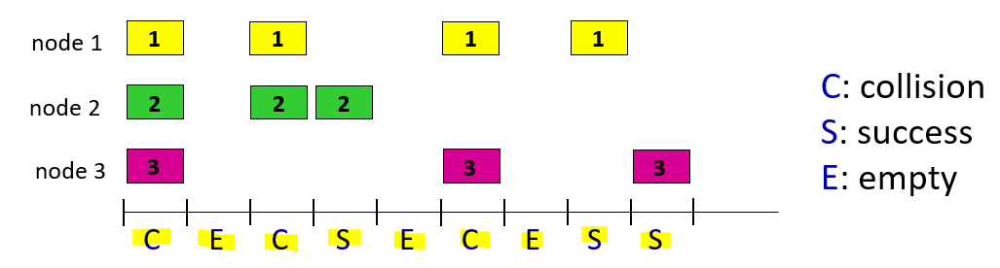
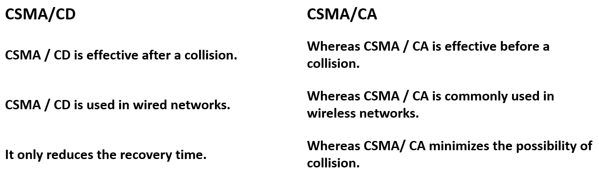
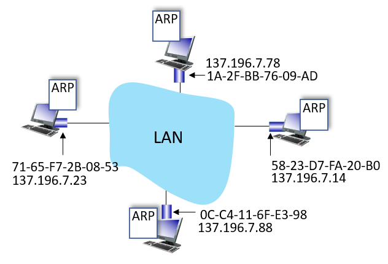

# 计网知识点总结 Week 10

## 1. 概述
### 1.1 概念和术语
- nodes 节点：any device that runs a link-layer protocol
  - 包括但不限于：主机，路由器，交换机，wifi接入点
- links 链路：**communication channels** that connect adjacent nodes along communication path（连接相邻节点的通信信道）
  - 有线
  - 无线
- frame：封装数据报
- 链路层的功能：link layer has responsibility of transferring datagram from one node to physically adjacent node over a link（通过链路将数据报从一个节点传输到物理上相邻的节点）
- different links use different link protocols
  - 每个链路之间的协议是可以不同的，第一段链路可能是无线的，第二段可能是有线的等等。第一段用的协议是wifi，第二段用的是以太网等等
  - 每个链路提供的服务可能是**可靠的/不可靠**的

### 1.2 链路层提供的服务
- framing, link access 成帧，链路接入: 
  - encapsulate datagram into frame, adding header, trailer 
  - “MAC” addresses in frame headers identify source, destination (different from IP address!) 通过MAC地址识别，而不是IP
  - channel access if shared medium
- reliable delivery between adjacent nodes 相邻节点可靠传输：
  - Using **acknowledgements and retransmissions**
  - seldom used on low bit-error links including fiber, coax, and many twisted-pair copper links（光纤、同轴电缆和许多双绞线铜链路）
  - wireless links: high error rates 无线高错误率
- error detection and correction 错误检测和纠正: 
  - errors caused by signal attenuation, noise（信号衰减、噪声）. 
  - receiver identifies and corrects bit error(s) **without retransmission**

### 1.3 链路层在哪里实现
- in each-and-every host
- link layer implemented in network adapter (network interface card (NIC)) or on a chip 网络适配器（网卡）或芯片
- attaches into host’s system buses 连接到主机的系统总线
- combination of hardware, software, firmware（固件）

### 1.4 接口通信

- 发送端:将数据报封装在帧中，增加了错误检查位、可靠数据传输、流量控制等。
- 接收端:寻找错误，可靠的数据传输，流量控制等。 提取数据报，传递到接收端的上层

## 2. 差错控制
### 2.1 概述
- EDC：错误检测和纠正位（例如冗余）
- D：受错误检查保护的数据，可能包括标头字段
- 不是百分之百可靠，可能会出错
  - protocol may miss some errors, but rarely
  - larger EDC field yields better detection and correction EDC场越大越好

### 2.2 奇偶校验
- 偶数奇偶校验:在一个长为d位数据中，添加一位作为额外位，这个位置的数据可以是0可以是1，但是添加了这一位之后“1”的数量要是偶数
- 奇数奇偶校验，就是把上面的偶数最后改成奇数
- 对突发错误不可靠

### 2.3 Cyclic Redundancy Check (CRC)
> 这里课件讲的不是很清楚，可以去[这个网站](https://blog.csdn.net/xwdrhgr/article/details/123257922)看一下大概的原理
- D是要检验的数据，R为增加的冗余位，G为约定好的除数

- CRC是相对可靠的

## 3. 多路访问协议
### 3.1 两种链路
- **point-to-point**
  - point-to-point link between Ethernet switch, host PPP for dial-up access
- **broadcast** (shared wire or medium)
  - old-fashioned Ethernet
  - upstream HFC in cable-based access network 
  - 802.11 wireless LAN, 4G/4G. satellite

### 3.2 MAC协议 (media access control protocol)
- determines **how nodes share channel**, i.e., determine when node can transmit
- Strategies for detecting, avoiding, and recovering from collisions
- 分类
  - channel partitioning 信道划分协议：将channel分为更小的部分（时间段、频率、代码），例如TDMA (time division multiple-accesas) 和 FDMA (frecuency division multiple-access)
  - take turns 轮流协议：节点轮流发送，例如token ring networks
  - random access 随即访问协议：不分割信道，也允许冲突存在，会采用方法去恢复，例如以太网和WiFi

### 3.3 random access protocol 随机接入协议
#### 3.3.1 Pure ALOHA
- unslotted Aloha: simple, no synchronization: 当一个帧到达时马上传送，如果没有ACK说明发生冲突，发生冲突随机等待一段时间后重传
- max efficiency = 1/2e = 0.18

#### 3.3.2 Slotted ALOHA

- 节点只在slot开始的时候传输，节点之间是同步的
- 如果发生冲突：节点在每个后续插槽中以概率 p 重新传输帧，直到成功
- 优点
  - single active node can continuously transmit at full rate of channel
  - highly decentralized（高度去中心化）: each node detects collisions and independently decides when to retransmit
  - simple
- 缺点
  - 冲突浪费slot
  - 有闲置的slot
  - 时间同步
- max efficiency = 1/e = 0.37

#### 3.3.3 CSMA (carrier sense multiple access)
- 传输之前先listen，如果有人占用就延迟，如果空闲则传输整个帧
- 仍然有可能发生碰撞：propagation delay causes that two nodes may not hear each other’s just-started transmission （刚刚开始，听不到彼此）
- 如果发生碰撞，那么浪费整个帧传输的时间，帧的propagation delay越长就越容易监听不到彼此
- ”不打扰其他人“

#### 3.3.4 CSMA/CD CSMA with collision detection
- 检测到碰撞的话立即中止
- 有线容易检测，无线不容易
- exponential backoff 指数回退
  - 随机选择k ∈ [0, 2n – 1], where n = number of collisions
  - 等待时间k*传输512 bits所用的时间
  - n的上限为10，16 次碰撞后帧掉落
- ”边说边听“
- 以太网使用CSMA/CD

#### 3.3.5 CSMA/CA CSMA with collision avoidance
- 碰撞前有效
- 如果信道忙碌，随机生成一个回退值，当信道空闲的时候-1.  当这个值减为0之后，就轮到这个发送节点发送
- 如果没有收到接收端的ACK，增大这个回退值，重复刚才的-1操作。
- WLAN使用CSMA/CA

#### 3.3.6 CSMA/CD和CSMA/CA的区别

## 4. MAC地址
> MAC地址是48位，burn 在NIC ROM中
> 功能：用于将帧从一个接口获取到另一个物理连接的接口（在一个子网下）

### 4.1 ARP: address resolution protocol 地址解析协议

- 所有IP节点（hosts and routers）都有ARP表
- ARP表中存储MAC地址、IP地址和TTL（一般是20min），如 < IP address; MAC address; TTL>
- 比如A想要给B发送数据报，但是B的信息没有在A的ARP表中，A广播（B的IP地址）寻找B的MAC地址，找到后将信息存储到A的ARP表中
- 子网之间帧的传输看[这个例子](https://jjlde7r0bk.feishu.cn/wiki/wikcnKDePQMJyB87JypBOcVbvhe)

