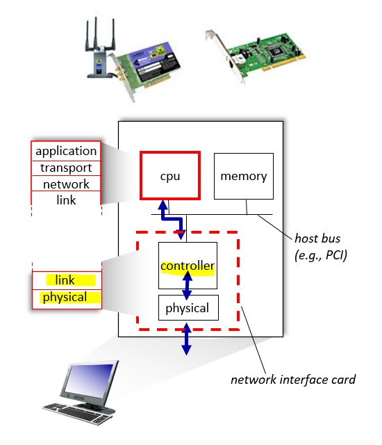
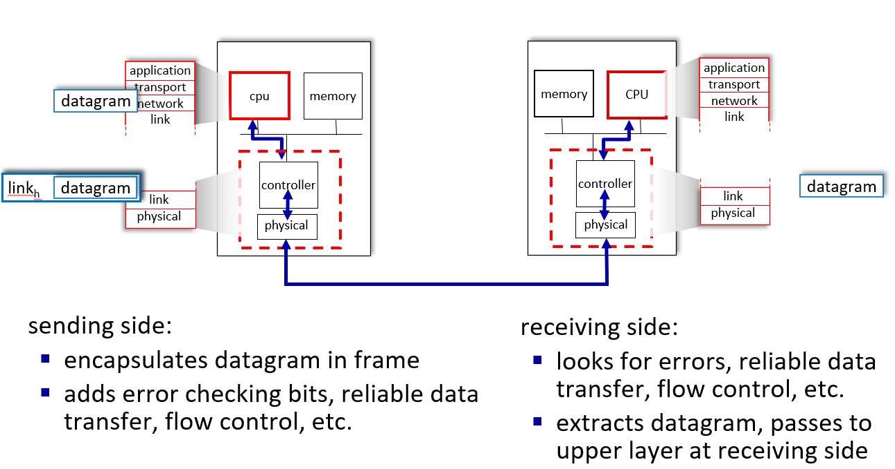
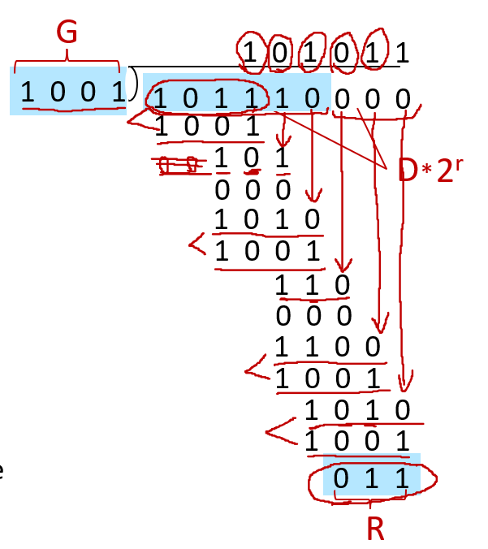

# 计网知识点总结 Week 10

## 1. 概述
### 1.1 概念和术语
- nodes 节点：any device that runs a link-layer protocol
  - 包括但不限于：主机，路由器，交换机，wifi接入点
- links 链路：**communication channels** that connect adjacent nodes along communication path（连接相邻节点的通信信道）
  - 有线
  - 无线
- frame：封装数据报
- 链路层的功能：link layer has responsibility of transferring datagram from one node to physically adjacent node over a link（通过链路将数据报从一个节点传输到物理上相邻的节点）
- different links use different link protocols
  - 每个链路之间的协议是可以不同的，第一段链路可能是无线的，第二段可能是有线的等等。第一段用的协议是wifi，第二段用的是以太网等等
  - 每个链路提供的服务可能是**可靠的/不可靠**的

### 1.2 链路层提供的服务
- framing, link access 成帧，链路接入: 
  - encapsulate datagram into frame, adding header, trailer 
  - “MAC” addresses in frame headers identify source, destination (different from IP address!) 通过MAC地址识别，而不是IP
  - channel access if shared medium
- reliable delivery between adjacent nodes 相邻节点可靠传输：
  - Using **acknowledgements and retransmissions**
  - seldom used on low bit-error links including fiber, coax, and many twisted-pair copper links（光纤、同轴电缆和许多双绞线铜链路）
  - wireless links: high error rates 无线高错误率
- error detection and correction 错误检测和纠正: 
  - errors caused by signal attenuation, noise（信号衰减、噪声）. 
  - receiver identifies and corrects bit error(s) **without retransmission**

### 1.3 链路层在哪里实现
- in each-and-every host
- link layer implemented in network adapter (network interface card (NIC)) or on a chip 网络适配器（网卡）或芯片
- attaches into host’s system buses 连接到主机的系统总线
- combination of hardware, software, firmware（固件）

### 1.4 接口通信

- 发送端:将数据报封装在帧中，增加了错误检查位、可靠数据传输、流量控制等。
- 接收端:寻找错误，可靠的数据传输，流量控制等。 提取数据报，传递到接收端的上层

## 2. 差错控制
### 2.1 概述
- EDC：错误检测和纠正位（例如冗余）
- D：受错误检查保护的数据，可能包括标头字段
- 不是百分之百可靠，可能会出错
  - protocol may miss some errors, but rarely
  - larger EDC field yields better detection and correction EDC场越大越好

### 2.2 奇偶校验
- 偶数奇偶校验:在一个长为d位数据中，添加一位作为额外位，这个位置的数据可以是0可以是1，但是添加了这一位之后“1”的数量要是偶数
- 奇数奇偶校验，就是把上面的偶数最后改成奇数
- 对突发错误不可靠

### 2.3 Cyclic Redundancy Check (CRC)
> 这里课件讲的不是很清楚，可以去[这个网站](https://blog.csdn.net/xwdrhgr/article/details/123257922)看一下大概的原理
- D是要检验的数据，R为增加的冗余位，G为约定好的除数

- CRC是相对可靠的
