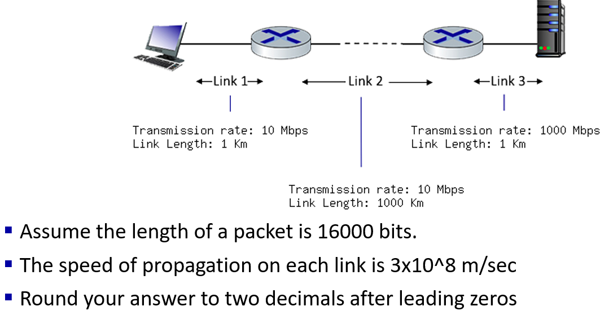
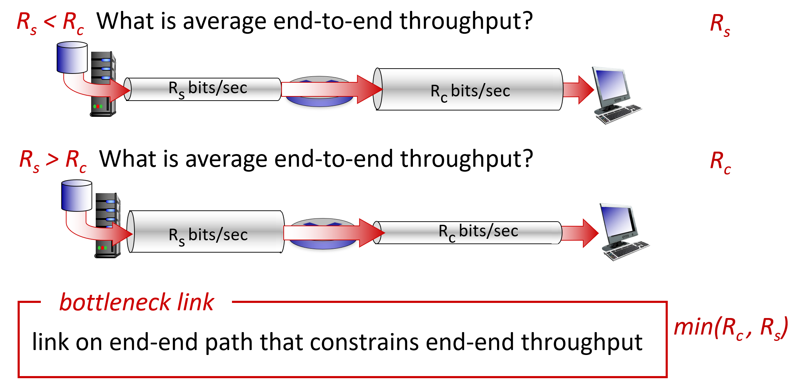
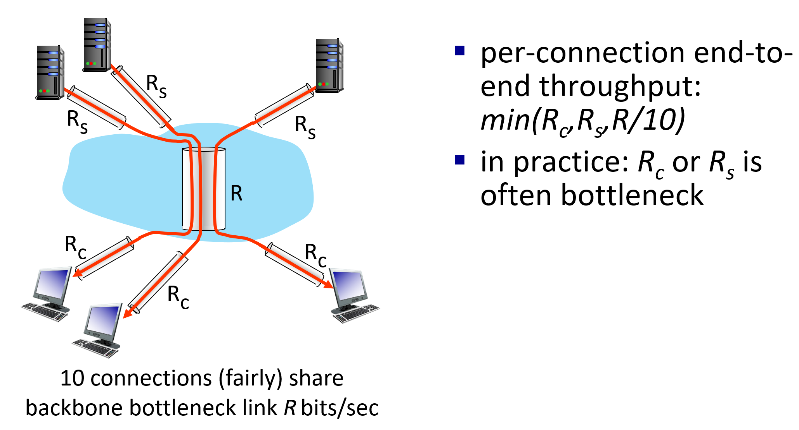
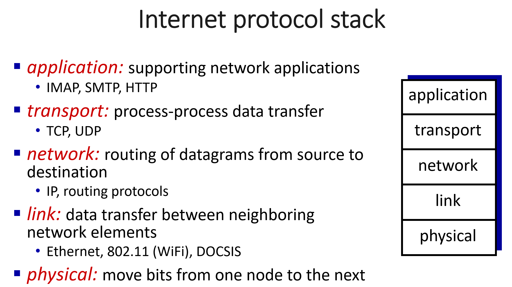
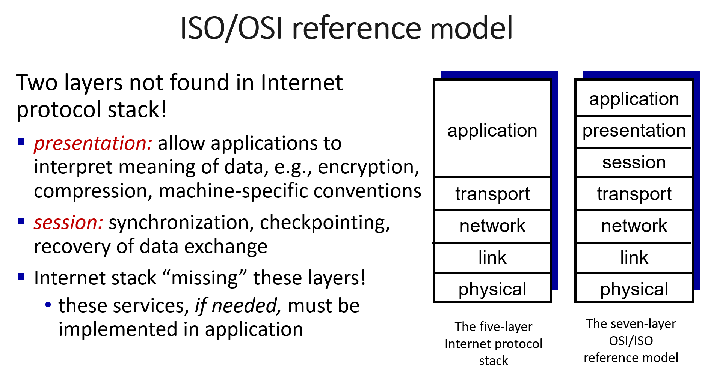
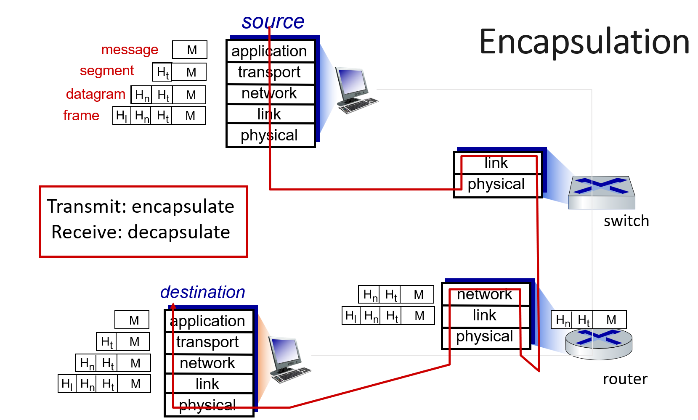

# 计网知识点总结 Week 2

## 1. Network performance
> 延迟：延迟是一种时间的度量。描述的是包在网络中传输的时间。单位为秒

### 1.1 延迟的种类
#### 1.1.1 处理延迟 processing delay
- 设备检查包头并决定将此包定向到何处所花费的时间
- 通常，这些延迟非常小——通常是微秒(10^(−6))
- 根据设备的繁忙程度而变化

#### 1.1.2 排队延迟 queueing delay
- 一旦一个包被处理，它将加入一个队列
  - 在这里，它等待离开设备
  - 直到它到达这个队列的头部才会被发送
- 如果队列为空，其排队延迟为零。
- 这个队列的长度和延迟取决于路由器的拥塞级别(例如，队列中较早到达的包的数量)。 
- 只有当链路(临时)的数据包到达率超过输出链路容量时才会出现队列

  - R是传输速率，L是包长度，a是平均包传输速率

##### 1.1.2.1 丢包：
- 排队的时候，如果缓冲区buffer满了，后面的packet会被丢掉。造成数据丢失
- 丢包方式：
  - Tail drop policy：丢掉最新到来的包
  - Random drop: 丢弃队列中的任意数据包 drop any packet within the queue.
  - Quality-of-service (QoS) aware: 数据包将根据它们的优先级被丢弃

#### 1.1.3 传输延迟 transmission delay L/R
- 将包放到物理链路的时间。
- 取决于包长度和传输速率（取决于路由器）

#### 1.1.4 传播延迟 propogation delay
- 物理线路的长度（媒介的距离） 除以 物理线路能允许通过的传播数率（速率）（比如说光的传播速率是3的10的8次方每秒）
- 记忆：介质一般说传播，传输的单词是transmission，传播是propagation
- 距离比较近的时候可以忽略不计

#### 1.1.5 节点延迟
- 以上四个延迟统称为节点延迟

## 2. 关于延迟的题目
### 2.1 How long does it take a packet of length 1,000 bytes to propagate over a link of distance 2,500 km, propagation speed 2.5*10^8 m/s, and transmission rate 2 Mbps? 

Propagation delay: 2500 * 10^3 / (2.5 * 10^8) = 0.01 seconds = 10 ms


### 2.2 What is end-to-end delay?

end-to-end delay is the total of all nodal delay from source to destination


### 2.3 What is Round-trip time (RTT)?

end-to-end delay measured in both directions 来回的路径不一定一样


### 2.4 Can you compute the end-to-end delay from source to destination taking into account transmission delay and propagation delay? 


Link 1 total delay = dtrans + dprop = 16000 bits / 10 Mbps + 1000 m / (3*10^8 m/s) = 1.6 ms

Link 2 total delay = dtrans + dprop = 16000 bits / 10 Mbps + 1000 * 10^3 m / (3*10^8 m/s) = 4.9 ms

Link 3 total delay = dtrans + dprop = 16000 bits / 1000 Mbps + 1000 m / (3*10^8 m/s) = 0.0193 ms

The total delay = Link 1 total delay + Link 2 total delay + Link 3

total delay = 1.6 ms + 4.9 ms + 0.0193 ms = 6.5 ms


## 3. throughput 吞吐量
### 3.1 定义
- transmission rate (bits/sec) at which bits are being sent from sender to receiver

### 3.2 average throughput

- 平均吞吐量取决于传输速率低的那一个
- 记住在算传输延迟的时候要把数据包长度换成bits

## 4. 分层 layering
### 4.1 为什么要分层
- dealing with complex systems
  - explicit structure allows identification, relationship of complex system’s pieces 显式结构允许识别复杂系统的碎片
  - modularization eases maintenance, updating of system 模块化简化系统的维护
- layering的好处概括为三点：Manage complexity, Modularity, Extensibility

### 4.2 Internet protocol stack 互联网协议栈

#### 4.2.1 Application layer
- 包含协议如 IMAP, SMTP, HTTP etc.（后续继续补充）
- packet的形式是message

#### 4.2.2 Transport layer
- 包含两个传输协议：TCP和UDP
- packet的形式是segment

#### 4.2.3 Network layer
- 包含IPprotocol和routing protocols
- packet的形式是datagram

#### 4.2.4 Link layer
- 包含Ethernet, WiFi等
- packet的形式是frame

#### 4.2.5 Physical layer
- packet的形式是bits

#### 4.2.6 ISO七层模型

#### 4.2.7 封装和传输的过程

- packet是从上到下封装的
