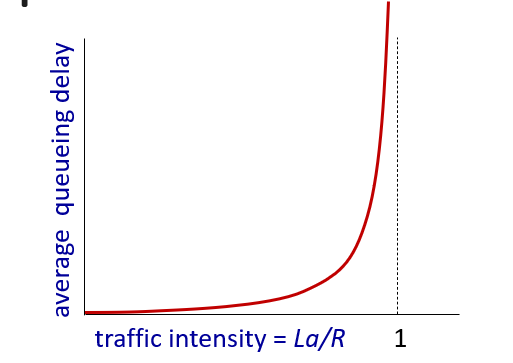
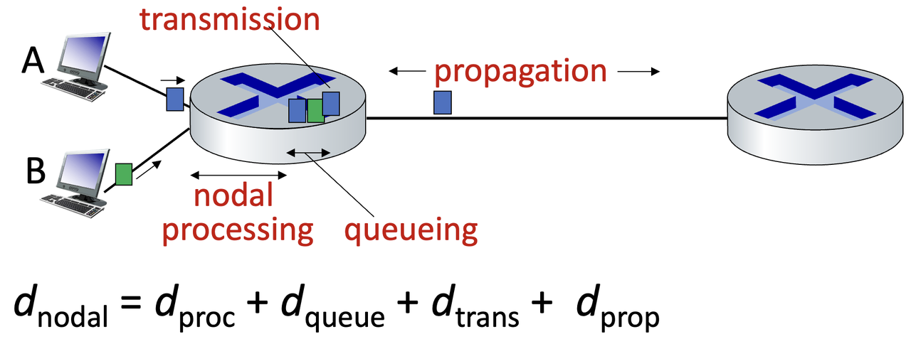

# 计网知识点总结 Week 2

## 1. Network performance
> 延迟：延迟是一种时间的度量。描述的是包在网络中传输的时间。单位为秒

### 1.1 延迟的种类
#### 1.1.1 处理延迟 processing delay
- 设备检查包头并决定将此包定向到何处所花费的时间
- 通常，这些延迟非常小——通常是微秒(10^(−6))
- 根据设备的繁忙程度而变化

#### 1.1.2 排队延迟 queueing delay
- 一旦一个包被处理，它将加入一个队列
  - 在这里，它等待离开设备
  - 直到它到达这个队列的头部才会被发送
- 如果队列为空，其排队延迟为零。
- 这个队列的长度和延迟取决于路由器的拥塞级别(例如，队列中较早到达的包的数量)。 
- 只有当链路(临时)的数据包到达率超过输出链路容量时才会出现队列

  - R是传输速率，L是包长度，a是平均包传输速率

##### 1.1.2.1 丢包：
- 排队的时候，如果缓冲区buffer满了，后面的packet会被丢掉。造成数据丢失
- 丢包方式：
  - Tail drop policy：丢掉最新到来的包
  - Random drop: 丢弃队列中的任意数据包 drop any packet within the queue.
  - Quality-of-service (QoS) aware: 数据包将根据它们的优先级被丢弃

#### 1.1.3 传输延迟 transmission delay L/R
- 将包放到物理链路的时间。
- 取决于包长度和传输速率（取决于路由器）

#### 1.1.4 传播延迟 propogation delay
- 物理线路的长度（媒介的距离） 除以 物理线路能允许通过的传播数率（速率）（比如说光的传播速率是3的10的8次方每秒）
- 记忆：介质一般说传播，传输的单词是transmission，传播是propagation
- 距离比较近的时候可以忽略不计

#### 1.1.5 节点延迟
- 以上四个延迟统称为节点延迟

