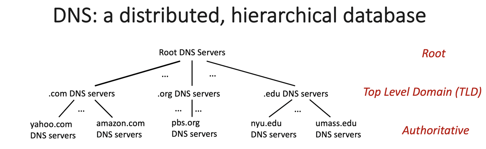
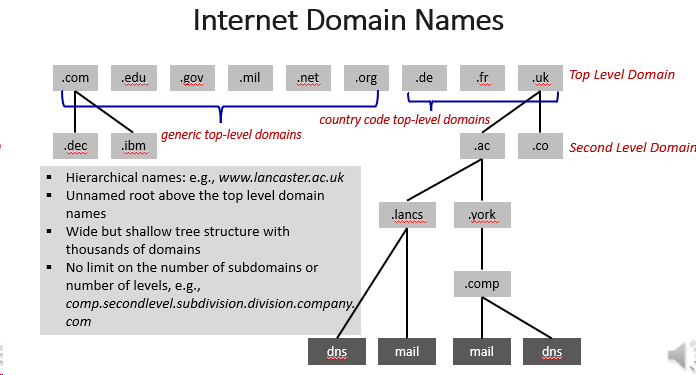
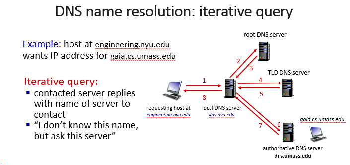
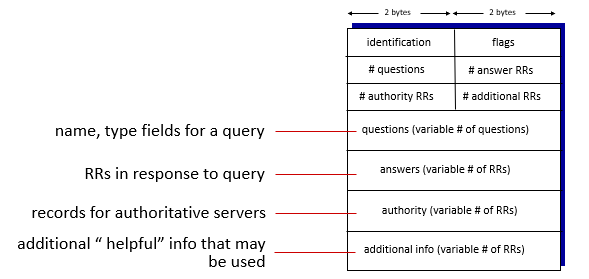
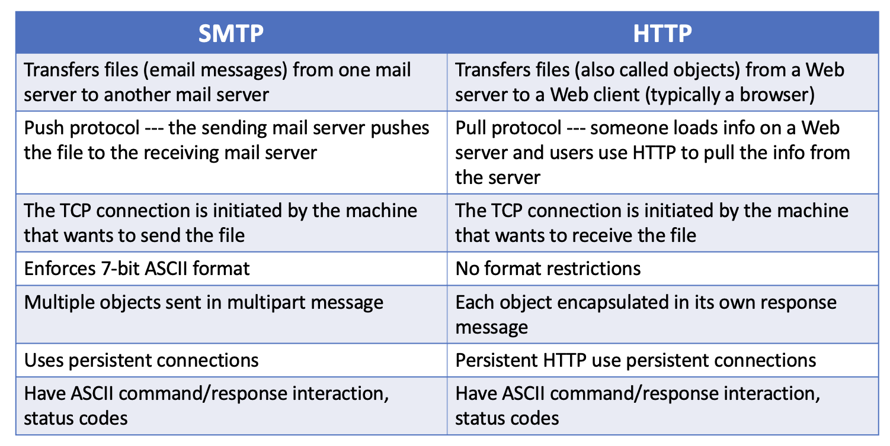
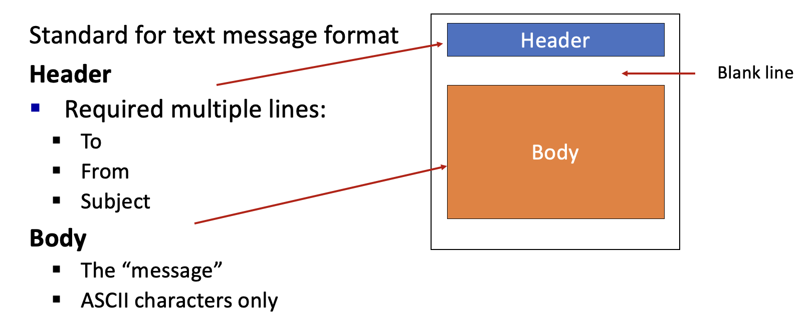
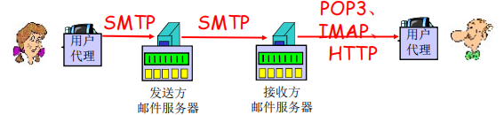

# 计网知识点总结 Week 4 (应用层：DNS和Email)

## 1. 命名和地址
- 一个网络的命名和地址有IP(IPv4, 4 bits)和Host name(e.g. lancaster.ac.uk)，DNS用来映射主机名和IP。

## 2. DNS: Domain Name System 域名系统
> 分布式分层数据库distributed database 层次化的数据库
> 
> 使用UDP 53号端口
>
> 体现了网络边缘的复杂性 complexity at network’s “edge”

### 2.1 DNS的用处
- 被**其他应用层协议**（例如HTTP和SMTP）用于将主机名转换成IP地址
- 为**互联网中的用户应用程序和其他软件**将主机名转换成底层IP

### 2.2 DNS的结构

- 从上到下依次去找，比如先定位到.com服务器，然后在下面找host name
- TLD顶级域名
- 为什么不采用集中式(centralize)的结构?
  - single point of failure 单点崩溃，全都崩溃
  - traffic volume 流量大
  - distant centralized database ？？
  - maintenance 难以维护
  - doesn't scale 无法扩展

- 从上到下依次是高级到低级的域名

### 2.3 Fully Qualified Domain Names (FQDN)
- 绝对域名，例如 mail.google.com. 
- FDQN通常以一个点作为结尾

### 2.4 Root name server
- ICANN (Internet Corporation for Assigned Names and Numbers) manages root DNS domain 
- 有13个logic root name servers，但是实习上远不止这些服务器（physical）

### 2.5 DNS名称解析：迭代查询

- 被联系的服务器回复目的服务器名称，
- "我不知道这个名字，可以问问这个server"
- 依次访问local DNS, root DNS, TLD DNS, authoritative DNS 

### 2.6 DNS records
> DNS: distributed database storing resource records (RR)
>
> RR format: (name, value, type, ttl)

- type=A
  - (hostname, IP address, A, ttl)
  - (relay1.bar.foo.com, 145.37.93.126, A)
  - 这种类型，将真实名称和ip对应起来
- type=NS
  - (domain, hostname of authoritative name server, NS, ttl)
  - (foo.com, dns.foo.com, NS)
  - 这种类型将dns和顶级域名对应起来
- type=CNAME
  - 值是别名主机名的“规范化”(真实)名称
  - (foo.com, relay1.bar.foo.com, CNAME) 
- type=MX
  - 值是具有别名主机名的邮件服务器的规范名称
  - (foo.com, mail.bar.foo.com, MX) 

### 2.7 DNS protocol messages DNS协议报文

- 请求和响应报文都是如上格式

## 3. Email
> 另一个application
>
> 通常是Asynchronous（异步的）

### 3.1 三个主要组成部分
- user agents 
- mail servers 
- communication protocols:
  - simple mail transfer protocol: SMTP
  - post office protocol 3 (POP3)
  - Internet mail access protocol (IMAP)

### 3.2 SMTP
- port 25
- 从sending server到receiving server的直接传输
- 传输的三个步骤
  - 建立TCP连接（握手）
  - 传输文件
  - 关闭连接

  - 邮件的发送不会经过其他的server，都是直接发送的
- SMTP采用持久连接
- SMTP要求邮件的标题和正文采用7位ASCII
- SMTP和HTTP对比

### 3.3 Mail Message Format 

### 3.4 POP3
- POP3在会话之间是无状态的
- 在交易阶段（transaction phase），可以被设置成两种模式
  - “download and delete” mode: 邮件在下载之后从服务器中删除
  - “download and keep” mode: 保留

### 3.5 IMAP
- 比POP3有更多功能
  - organize emails in folders
  - 所有更改，服务器与邮箱客户端同步
  - Keeps user state across sessions 跨会话保持用户状态
  - allows parts of a message to be retrieved 允许检索消息的部分内容

### 几个协议的关系总结

### 基于web的email
- 使用HTTP协议传输
- 但是在邮件服务器之间仍使用SMTP
