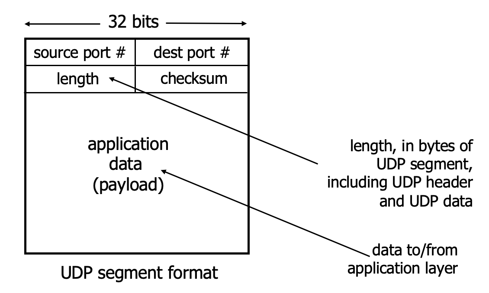

# 计网知识点总结 Week 5 (传输层概述)

## 1. 传输层综述
### 1.1 功能
- provide **logical communication** between application processes running on different hosts 注意是在不同主机上运行的应用进程
- transport protocols implemented in end systems not in routers 在终端系统中实现，不是路由器 （路由器只有Network，Datalink，Physical）
- TCP和UDP是两种传输层协议
  - TCP提供的服务：
    - reliable, in-order delivery
    - congestion control 
    - flow control
    - connection setup
  - UDP是不可靠的传输

### 1.2 传输层服务
- Connection oriented service 面向连接的服务
  - connection set-up, data transfer, disconnect 
- Connectionless service 
  - isolated unit 独立单元的传输

### 1.3 传输层的任务
- 将上层与子网的技术、设计和缺陷（imperfections）隔离开来
- 在（可靠）数据传输服务的提供者和用户之间建立主要界限（major boundary）

### 1.4 传输层的目的
- To **Improve the Network Service quality** that users and layers want to get from the network layer
- 通过传输实体（transport entity）实现

## 1.5 一些传输层功能（细化）
- Multiplexing/de-multiplexing data for multiple applications 
- Uses “port’’ abstraction
- Error control 
- End-to-end flow control 
- Congestion control 

## 2. Multiplexing/demultiplexing 多路复用/多路分解
> mutiplexing(sender): handle data from multiple
sockets, add transport header (later used for demultiplexing) and pass segments to network layer 将来自多个socket的数据集合，加传输头，把segments给网络层
> demultiplexing(receiver): use header info to deliver received segments to correct socket 利用头部信息把segments传输到正确的socket

### 2.1 demultiplexing 如何工作
- 每一个datagram中都有源IP和目标IP
- 每一个datagram都携带一个transport segement，segment中有源端口和目标端口的信息
- 通过IP和端口定位到对应的host，传输segment

### 2.2 UDP: User Datagram Protocol
- 没有握手，传输的数据可能会丢失/无序（out-of-order）交付到application
- 为什么用UDP？
  - no connection establishment
  - simple(在sender和receiver处没有连接状态)
  - smaller header size
  - no congestion control
- 如果可靠传输需要使用UDP，在应用层加上所需的可靠性和拥塞控制

### 2.3 UDP segment header

### 2.4 UDP checksum
- 16bits直接做加法，如果有进位加到最后面
- checksum是对sum的取反

### 2.5 UDP的优点
- no setup/handshake needed（不会产生RTT）
- can function when network service is compromised 网络服务不可用的时候UDP仍是有效的
- 有checksum（一部分reliability）

