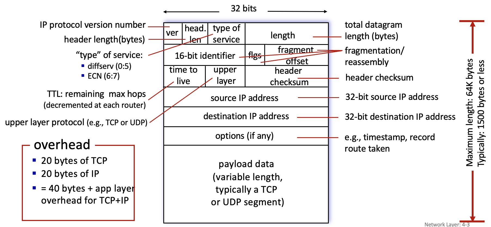
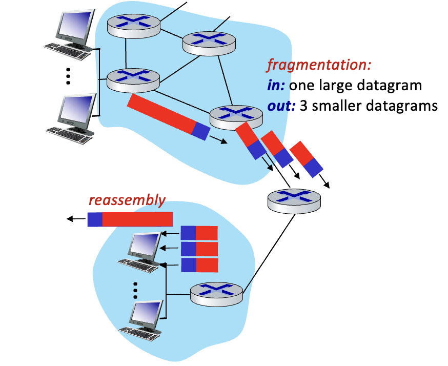
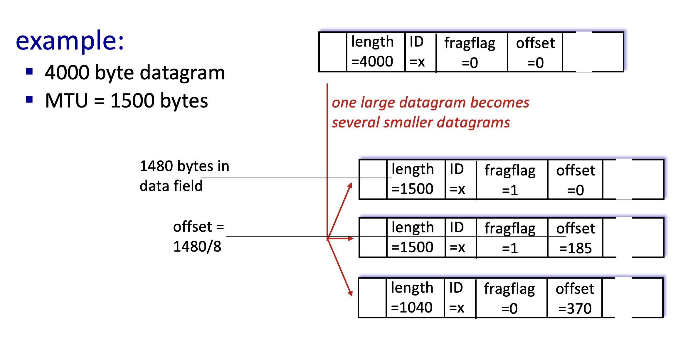
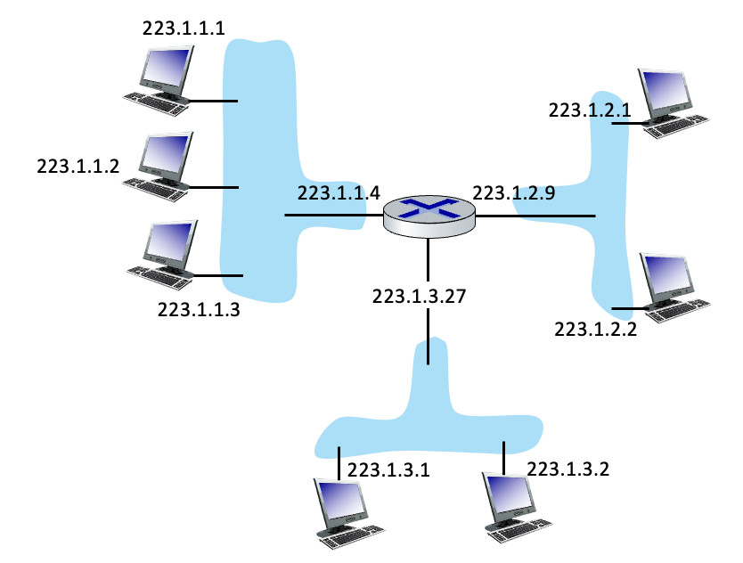
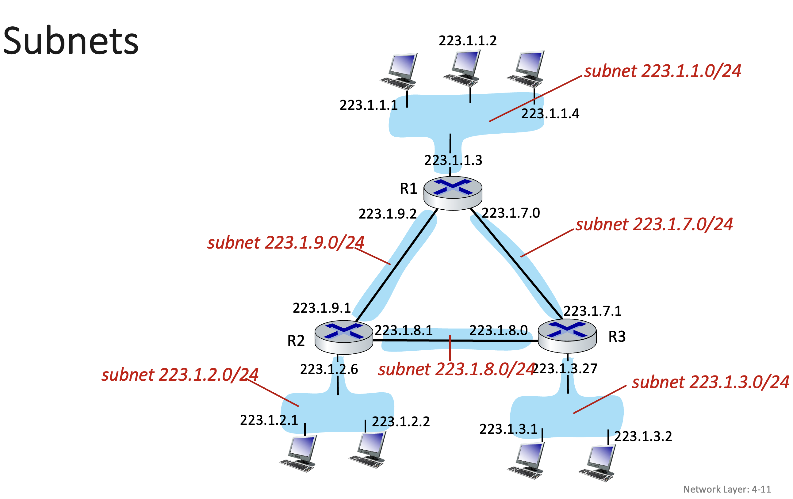
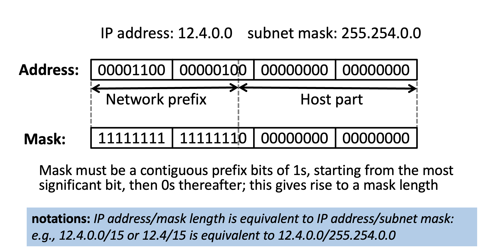
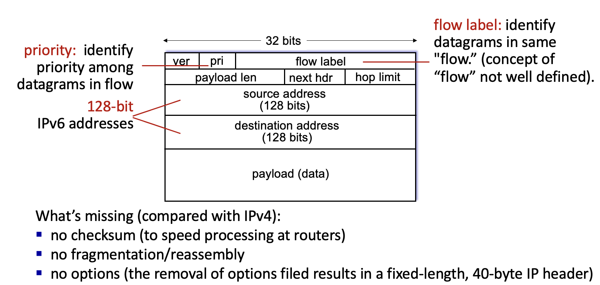
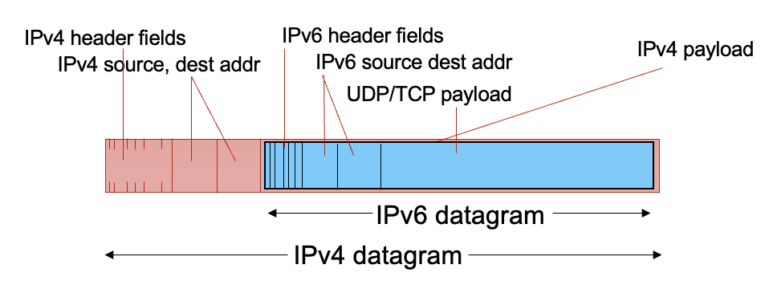
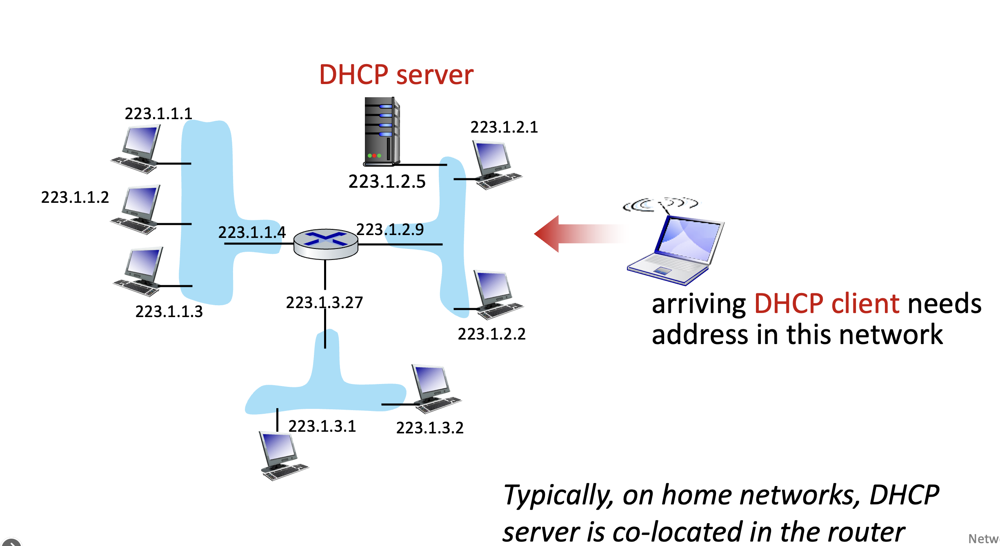

# 计网知识点总结 Week 7 (网络层)

## 1. 网络层服务和协议
- communication service
  - sender: encapsulates segments into datagrams, passes to link layer
  - receiver: delivers segments to transport layer protocol
- 每个设备的网络层协议在host和routers中
- 路由器检查每一个通过的IP数据报的header fields，把数据报从输入端口发送到输出端口

## 2. IPv4 & addressing
### 2.1 IP数据报

### 2.2 IP datagram的分段和重组

- 不同的链路有不同的MTU(max transmission unit)，所以IP datagram有时会进行分段，IP header bits用来识别和定位，分段后的碎片在目的地进行重组

### 2.3 IP addressing

- interface: connection between host/router and physical link 接口的定义
  - 路由器有多个接口，主机有1-2个接口
- IP address与每个接口对应，32位（每个数字是八位二进制数）

### 2.4 subnet
- definition: device interfaces that can physically reach each other without passing through an intervening router 无需经过路由器就能到达彼此
- 子网有相同的高阶位（common high order bits），不同的低阶位（主机号），注意主机号不能全为0或者全为1

#### 2.4.1 subnet mask 子网掩码
- 比如/24 就代表32位中的前24位代表子网地址，后面代表主机号

#### 2.4.2 有多少子网？

- 6个

#### 2.4.3 CIDR: Classless InterDomain Routing 

### 2.5 关于IP的补充
- ISP怎样得到地址块？

ICANN: Internet Corporation for Assigned  Names and Numbers http://www.icann.org/

- 有足够的32位IP地址吗

2011年已经分配完了最后一个32位IP地址

IPv6有128位IP地址

- 路由聚合：增多子网掩码的位数

### 2.6 IPv6
- 八组四个16进制数字

- IPv4和IPv6之间的网络如何建立？
  - tunneling: IPv6 datagram carried as payload in IPv4 datagram among IPv4 routers (“packet within a packet”) IPv4里面包一个IPv6

## 3. DHCP: Dynamic Host Configuration Protocol 
- 分配子网的主机号，动态的向服务器请求一个IP
- 运行在UDP/IP上
- 一般由ISP/LANs/organizational networks使用

- server 和 client之间的连接一般由四个步骤
  - client: DHCP discover
  - server: DHCP offer
  - client: DHCP request
  - server: DHCP ACK
- DHCP can return more than just allocated IP address on subnet:
  - address of first-hop router for client 客户端第一跳的路由器
  - name and IP address of local DNS sever 本地DNS服务器的名称和IP
  - network mask (indicating network versus host portion of address) 这个是什么，子网掩码吗

