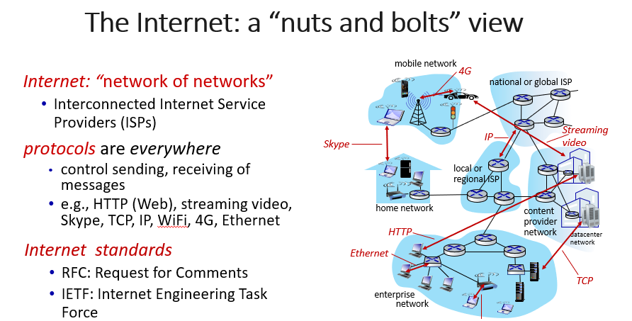

# 计网知识点总结 Week 1

## 1. What is a network
  - Any set of interconnected nodes through horizontal and or vertical lines.
  - 通过平行或者垂直的线，连接起来的节点的集合
  - 有什么样的网络，（除了计网之外的例子）: Telephone network carrying voice traffic, Cable network to disseminate video signals

## 2. 什么是计算机网络？computer network
  - A computer network is a group of computers that use a set of common communication protocols over digital interconnections for the purpose of sharing resources.  
  - 计算机网络是一组计算机，它们通过数字互连使用一套共同的通信协议，以达到共享资源的目的。
  - Set of connected autonomous computers (having programmable hardware) 是一系列自治的，互联的，有可编程硬件的计算机的集合

### 2.1 计网的功能，为什么需要计网
Resource Sharing, Information Sharing, Ease in Communication 资源共享，信息共享，方便沟通

### 2.2 计网的类型
#### 2.2.1 直接连接
- 点对点point to point 就是两台计算机一条线连起来，常用于远程的广域网链接
- 多重连接multiple access 就是多台计算机连接一条总线,通常用于局域网链接

#### 2.2.2 非直接连接
- （用交换机）电路交换，包交换

## 3. 什么是互联网？internet
- The internet is a computer network that interconnects billions of computing devices using communication links and packet switches.
  - 互联网是一个计算机网络，利用通信链路和分组交换机将数十亿的计算设备（称为主机或终端系统）互联起来。
  - 互联网是最为熟知的计算机网络。
  - 有两种不同的描述internet的方法，一种是由组成部件去描述internet，另一种是从提供服务的角度描述internet

### 3.1 a “nuts and bolts” view，具体来看什么是internet
- The basic hardware and software components that make up the Internet.

#### 3.1.1 Devices 
- 主机（hosts） = 终端（end systems）
- running network apps at internet's eges

#### 3.1.2 Packet switches
- 路由器（routers）
- 交换机（switches）

#### 3.1.3 Communication links
- 光纤、铜线、无线电、卫星fiber copper radio satellite 
- 传输速率：带宽

#### 3.1.4 Networks 
- 设备、路由器、链接的集合：由一个组织管理collection of devices, routers, links: managed by an organization

### 3.2 a “service” view
- **因特网是一种基础设施**：为应用程序提供服务的基础设施 Infrastructure that provides services to applications。网络、流媒体视频、多媒体电话会议、电子邮件、游戏、电子商务、社交媒体、相互连接的设备等。
- **因特网提供编程接口**：为分布式应用提供编程接口 provides programming interface to distributed applications:。"钩子 "允许发送/接收应用程序 "连接 "到，使用互联网传输服务。提供服务选项，类似于邮政服务

## 4. 什么是协议？
- Protocols define the format, order of messages sent and received among network entities, and actions taken on msg transmission, receipt
- 协议定义了网络实体之间发送和接收消息的格式、顺序，以及在消息传输和接收时所采取的动作。
- All activity on the Internet that involves two or more communicating remote entities is governed by a protocol.
- 凡是涉及两个或者多个通信实体的所有活动都要受到通信协议的制约。

## 5. 网络边界
### 5.1 网络边缘
- 主机分成客户端和服务端（client and server）
- 服务器（server）通常在数据中心（data center）

### 5.2 网络核心
- routers and switches
- network of networks

---

