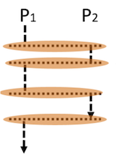
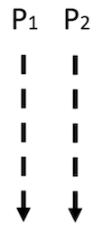
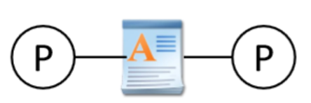
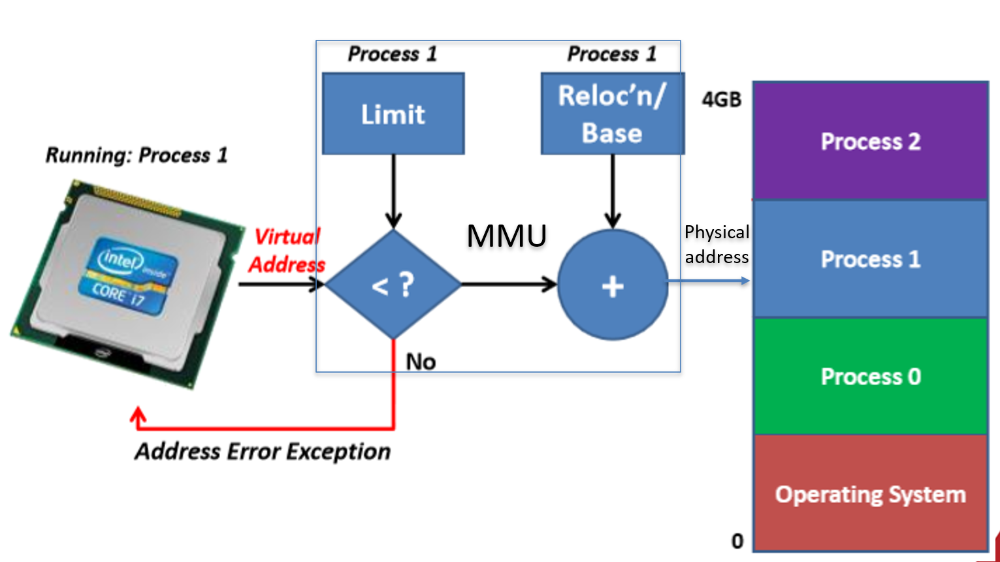

# 操作系统考点总结（按章节）



这是我总结的操作系统的考点，但内容并不完善，可以参考[这篇笔记](https://jjlde7r0bk.feishu.cn/wiki/wikcnjqZ54DulF74jkJayfSN48d)，里面有更详细的我关于知识点的记录


关于操作系统的考试题目以及题型，可以参考[这篇笔记](https://jjlde7r0bk.feishu.cn/wiki/wikcnnaABCfgLcZrWn7Y3ClrU9d)



## Chapter 1
> updated in 2023.1.13

**1. Monolithic OS（单一型）的优缺点？（单一型是os类型之一，用户和系统放在一起）**
- 优：(1) efficient; (2) better performance
- 缺：(1) Difficult to impose security; (2) difficult to maintain
  

**2. Layered OS：**

- 优：security
- 缺：hard to manage; weak performance
  

**3. Micro-Kernel OS (微内核os)：**
- 优：security；extensible
- 缺：inefficient
  

**4. Library OS (库操作系统)：**
- 优：libraries provide additional security and personality
- 缺：less consistency(缺乏稳定性)

---

## Chapter 2
> updated in 2023.1.13

**1. One or more threads in a single process**
- Thread: smallest sequence of instructions managed independently by scheduler. 
- Scheduler: method for how work is assigned to resources to complete work

**2. Concurrency & parallelism (并发和并行)的区别？**
- Concurrency: processes are underway simultaneously, different processes execute one by one.

<!--  -->

- Parallelism: Multiple (n \> 1) processes executing simultaneously. 

<!--  -->

<!--  	 -->
- 对于并发，在同一时间点任务不同时execute；对于并行，在同一时间点任务一定同时execute，并发和并行都是针对process而言的
- Processes are always concurrent, but not always parallel


**3. 怎样创建一个线程：通过implement Runnable 类，里面有一个public void run( ) 方法**
- Define class R which implements Runnable
- Create your objects
	- Make an instance of class R 
	- Make a thread instance by passing instance of   class R to the constructor of class Thread
- Class start() method of the thread instance
	- This causes java to immediately execute R.run() as a new thread
- 替代方法还可以创建一个类继承Thread类，理论上和实现Runnable是一样的
	```java
	public class MessagePrinter extends Thread
	  { 
	     String message; 
	     public MessagePrinter(String m) 
	        { 
	           message = m; } 
	     public void run() 
	         { for(int i = 0; i < 1000; i++)    
	     System.out.println(message); 
	         }
	 }
	
	```

**4.  Processor（处理器）, program（程序）, process（进程） 三者区别？**
- Processor: _Hardware device_ that executes machine instructions
- Program: _Instruction sequence_; Stored on disk 指令集；存储在硬盘上
- Process：_Program in execution_ on a processor; store in primary memory
- Program may be executed by multiple processes at the same time

<!--  -->
- Process can run multiple programs. (多个thread)

<!--  -->


**5. When do we not have to worry about concurrency?**
- no shared data or communication
- read only data


**6. When should we worry about concurrency? （并发带来坏的影响）**
- Threads access a shared resource without synchronization
- One or more threads modify the shared resource

---

## Chapter 3

> updated in 2023.1.13


**1. Moore’s Law: Number of transistors in dense(密集) integrated circuits doubles every 2 years.**

**2. 为什么要用并行？（两个原因）**
  - Moore’s Law(硬件): Number of transistors in dense(密集) integrated circuits doubles every 2 years.
  - Amdahl’s Law(软件)：Speed up is limited by the serial（程序串行） part of the program


**3. Definition of race condition**
- An error (e.g. a lost update) that occurs due to multiple processes ‘racing’ in an uncontrolled manner through a section of non-atomic code


**4. 什么是临界区（critical section）?**
  - Code section that accesses a shared resource.


**5. What is Mutual exclusion?**
- Only one thread can run within the critical section at any given time


**6. 建立临界区的4种方法？**
  - Lock: 
	- 设置两个状态held/not held，held表示有线程在critical section
	- acquire代表需要lock，release代表不需要lock
	 and release( )")
	- lock在java中通过synchronized语句实现，synchronized可以应用于任何的代码块
		```java
		public void synchronized update (int a) 
		{
		     balance=balance+a;
		 }
		
		```
- Monitors
  - Semaphores
  - Message


**7. Atomic**
- A property of a sequentially-executed section of code
- A context switch can’t happen (by definition) while an atomic section of code is being executed


**8. Lock acquire( ) only blocks threads attempting to acquire the same lock. Must use same lock for all critical sections accessing the same data.**

**9. Three steps of context-switching sequence**
- De-schedule currently-running thread
- Scheduler selects ‘best’ ready thread to run next 
- Resume newly-selected thread 

---

## Chapter 4

> updated in 2023.1.16


**1. 信号量（改错）：**
```c
typedef struct _sem { 
    int val; /* semaphore  value*/ 
    Queue queue; / oper: put, get*/ 
} Sem
void P(Sem s) { /* wait() procedure */ 
      s->val = s->val - 1; 
      if (s->val < 0) { 
           put(s->queue, getpid()); /* queue of PIDs */ 
            sleep(getpid()); } } 
void V(Sem s) { /* signal() procedure */ 
        s->val = s->val + 1; 
         if (s->val >= 0){ 
           wakeup(get(s->queue));} }
```
- P等同于wait，V等同于signal
- `sleep`是通过把这个线程放到waiting queue中来block这个线程
- `wakeup`是唤醒waiting queue中的线程，并放到running queue中

**2. P，V操作如何在java和C下实现的？**
  - Java: wait() & notify()
  - C: acquire() & release()
  - Unix: sleep() & wakeup()
  - Distributed system分布式系统（Message Passing）: send() & receive()

**3. 虚假唤醒（Spurious wakeup）是考试中一道大题**

```java
public class Semaphore { 
    private int count = 0;   
    public Semaphore(int init_val){ 
         count = init_val; 
    } 
    public synchronized void P() { 
        count = count - 1; 
        if (count < 0) wait(); 
    } 
    public synchronized void V() { 
        count = count + 1;
        notifyAll(); 
    }
}
```
- 什么时候会引起虚假唤醒？
- Answer: Does not recheck the condition，把P中的`if`改为`while`

**4. 编程题： put() get()操作**
```java
public class BoxDimension{
   private int dim = 0;
   private Semaphore sem = 1;
   public void put(int d) {
       dim = d; 
       sem.signal();
   } 
   public int get() {  
       sem.wait();
       return dim; 
    }
} 
BoxDimension d = new BoxDimension();
```

**5. Java中的semaphore**

```java
public class Semaphore { 
    private int count = 0; 
    public Semaphore(int init_val) { 
           count = init_val; // Should check it’s >= 0 
    } 
    public synchronized void P() { 
           count = count - 1; 
           while (count < 0) wait(); // why not ‘if’? 
       } 
    public synchronized void V() { 
            count = count + 1; /* if there is one, wake a waiter; */
            notifyAll(); /* why not use ‘notify()’? */ 
    } 
}
```
- P中要使用`while`来判断是否要wait，因为如果条件满足要一直wait
- V中要使用`notifyAll()`，而不是`notify()`，因为`notify()`会导致`deadlock`

---

## Chapter 5

> updated in 2023/2/9

1. **Synchronous message-passing model (rendezvous) doesn’t allow the producer to get ahead of the consumer. This limits concurrency. 同步消息传递模型不允许生产者先于消费者。这限制了并发性。**

2. **message passing definition**

   Processes communicate by sending & receiving messages using *primitives* (including synchronization)

3. **同步消息传递**

   - 使用send和receive函数来进行消息的传递，call send函数的进程直到消息被接收到才会解除block，receive函数直到消息完全发出来才会解除block
   - sender: `send(msg, channel)`

   - receiver: `var = reveive(channel)`

   - e.g. 

     ```java
     Sender() 
         { 
           messagetype item; 
           item = produce_item();      
           chan.send(item); 
     	}
         
     Receiver() 
        { 
          messagetype item; 
          item = chan.receive(); 
          consume_item(item); 
        }
     ```

   - 同步消息传递存在的问题
     - 降低了并发性(reduce concurrency)
     - client-server interaction
       - When client releases a resource, usually no reason for waiting until the server has received the release message
       - When client writes to a device (graphics display) it can usually continue without waiting for the sever to receive the message

4. **异步消息传递**
   - 同样使用send和receive，但是call send函数的进程不会被block，receive函数直到一个消息发出来了就解除block
   - 异步消息传递存在的问题
     - Acknowledgement 确认
       - Receiving process cannot know anything about the current state of the sending process 接收进程不知道发送进程的状态
       - Sending process has no way of knowing if message was ever received unless the receiving process sends reply 发送进程不知道消息有没有收到
     - difficult failure detection
     - finite buffer space：如果同时发送太多的message，程序会crash，buffer会overflow，一些message可能会loss，从而会block发送进程

5. **MP code**

   - 同步

     ```java
     producer() {
        messagetype item; 
        while (TRUE) { 
         item = produce_item();
         chan.send(item); // send item on channel } } 
     consumer() {
           messagetype item; 
            while(TRUE) { 
                item = chan.receive(); // receive item       
                consume_item(item); 
     } }
     ```

   - 异步

     ```java
     producer() {   
         messagetype item; 
         while (TRUE) { 
                 item = produce_item(); 
                 credit = credit_chan.receive(); // wait for a credit  
                 data_chan.send(item); // send item } } 
     consumer() { 
          messagetype item; // Prime producer with N credits... 
          for (int i=0 i<N; i++) 
              credit_chan.send(credit); 
               while(TRUE) { 
                     item = data_chan.receive(); // receive item  
                     credit_chan.send(credit); // send back credit  
                     consume_item(item); 
               } 
     }
     ```
     

---

## Chapter 6

> updated in 2023/2/11

1. **Blocking(直接阻塞) 和 Spinning lock(自旋锁)比较：**

   - Blocking：Scheduler blocks threads while they wait 
     - 优点：Good for long critical sections 
     - 缺点：Costly if lock accessed lots（锁访问得多就代价高）

   - Spinning: Sit in a tight loop until lock acquisition 
     - 优点：Good for short critical sections 
     - 缺点：Costly for long critical sections 

2. **自旋锁的实现**

   *普通的自旋锁*

   ```java
   void get_lock (int *lk) { 
       while (*lk ==1); // 如果lk不是1，跳出循环，拿到锁
       *lk = 1; // Claim the lock }
   
   void release_lock (int *lk) {
       *lk = 0; //Let someone else claim lock 
   }
   ```

   - 上面的代码有问题，如果两个进程同时调用`while(*lk = 1)`的话，会发生mutual exlusion，解决方案是在此处使用`disable_interrupts();`函数，因为同时访问critical section只会在发生中断的情况下发生；然后在释放锁的时候调用`reenable_interrupts();`函数，来重新启用中断
   - 无论如何，上面的代码还是有很多缺陷，例如中断被长时间禁用、release_lock忘记启用中断等，所以依旧不是一个好的解决方案

   ```java
   void get_lock (int *lk) {
             try_again: 
            disable_interrupts(); 
            if (*lk ==1); // Lock taken  
              { reenable_interrupts(); //permit context switch  
                 go to try_again; //spin 
              } 
             *lk = 1; // Claim the lock 
               Reenable_interrupts(); 
   }
   void release_lock(int *lk) {
        *lk = 0; //Let someone claim lock 
   }
   ```

   - 这个版本的代码解决了中断使用的问题，但仍存在其他问题

   *机器指令（test_and_set）：通过硬件解决*

   ```java
   boolean test_and_set(boolean *target) { 
       boolean orig_val = *target; 
       *target = TRUE; 
       return orig_val; // 将target置为true但是并不更改返回的值，返回的还是原先的值
   } 
   void get_lock (int *lk) { 
       while(test_and_set(lk) == 1) ; // wait 
   }
   void release_lock(int *lk) {
       *lk = 0; //Let someone claim lock 
   }
   ```

   *Peterson’s Algorithm：通过软件解决（仅适用于两个线程！！！）*

   ```java
   int tiebreak = 0; /* shared variable */ 
   bool[] flag = {FALSE, FALSE}; /* shared variable */ 
   void get_lock() { 
       int pid = thread_getid(); 
       int other = 1 - pid;
       flag[pid] = TRUE;
       tiebreak = other; 
       while(flag[other] && tiebreak == other); /* spin */
   } 
   void release_lock() { 
       flag[thread_getid()] = FALSE; 
   }
   ```

   - 解释一下，如果同时有两个进程访问get_lock的话，如果另一个进程是false的话就会跳出循环，执行成功；如果另一个进程也是true，就会卡在while循环
   - while这里是双重确认，任何一个条件都不能省略，因为另一个进程进来的时间是不可控的

3. **monitor是什么？**
   - Concurrent control construct for synchronization and scheduling 用于同步和调度的并发控制结构

---

## Chapter 7

> updated in 2023.2.11

1. **条件同步和锁的区别？**
   - 条件同步实现了互斥性，原子性，还实现了顺序执行（sequential execution）
   - 锁实现了互斥性和原子性（Mutual repulsion, atomicity）

2. **实现先put()再get()（增加一个布尔值done_put）：**

   ```java
   public class Dimension { 
      private int dim = 0; 
      private boolean done_put = FALSE;
      public void synchronized put(int d) { 
          dim = d; 
          done_put = TRUE;  
          notify(); 
      }
      public int synchronized get() { 
          while (!done_put)         
              wait(); 
          done_put = FALSE;  
          return dim; 
      }
   }
   ```

3. **notify()和notifyAll()的使用**

   - 一般使用`notifyAll()`，不会导致死锁，但是效率低
   - 在仔细考虑所有情况下的调度后可以使用`notify()`，效率高

4. **基于优先级的barrier**

   ```java
   public class Barrier { 
       int highest = 0; 
       int next_highest = 0;
       public void synchronized pause() { 
           int p; 
           if ((p = get_priority()) > highest) { 
               //Compare thread priorities 
               next_highest = highest; 
               highest = p; 
           } 
           else if (p > next_highest) { 
               next_highest = p; 
           } 
           do wait () while(p < highest); 
           highest = next_highest; /*set highest for next time */ 
       }
       /* Resume the paused thread with the highest priority */
       public void synchronized resume_highest_priority() { 
          notifyAll(); 
       } 
   }
   ```

5. **bounded counter**

   ```java
   public class BoundedCounter implements IBoundedCounter {
       long count = MIN; 
       public synchronized long value() {return count;}
       public synchronized void inc() { 
            while(count == MAX) wait(); 
            if (count++ == MIN) // notify if we were in ‘min’ state  
                 notifyAll(); // ... let any blocked decrementer resume 
       } 
         public synchronized void dec() { 
              while(count == MIN) wait(); 
              if (count-- == MAX) // notify if we were in ‘max’ state 
                  notifyAll(); // ... let any blocked incrementer resume 
         }
   }
   ```

   - `if (count++ == MIN)`指的是`if (count == MIN)`和`count++`，就算if不成立也会执行count++
   - `notifyAll()`唤醒所有的线程（如果刚脱离最小，就可以减了，如果刚脱离最大，就可以加了）

---

## Chapter 8

> updated in 2023.2.11

1. **fork():** 

   - 产生父进程，return value>0; 产生子进程，return value=0 (`setjmp()` and `longjmp()`)

2. **(必考) How many processes are created by the program as a function on n?**

   Answer: 2^n - 1

   ```c
   int main() {
       int i; 
       for(i=0; i<4; i++) fork(); 
   } // 2^4-1=15
   ```

3. **线程(Thread)分哪三类？**

   - User thread（用户线程）

   - Kernel thread（内核线程）

   - Language thread（语言线程）

4. **User thread vs Kernel thread vs Language Thread**

   - **User thread:** 

     - 优点：Cheap context switch; faster than kernel thread; 

     - 缺点：User threads in same process can’t execute on separate CPUs 同一个进程的线程不能执行在分开的CPU上

   - **Kernel thread:**

     - Scheduled by OS scheduler

     - Threads are preemptive by the OS（线程被操作系统抢占）

   - **Language thread:**

     - Available only in particular language environments
     - Might be implemented either as user or kernel threads

   - **区别：**

     - User threads require no support from the OS

     - Kernel threads are supported by the OS 

---

## Chapter 10

> updated in 2023.2.11

1. **Common pitfalls in concurrent programming(常见的陷阱类型)：**

   - Non-correctness: introduce subtle programing errors 引入微小的编程错误

   - Deadlock: 两个或多个线程被阻塞，永远等待对方放弃资源

   - Livelock

   - Flawed mutual exclusion

2. **引发死锁的原因**

   - Mutual exclusion of resources 资源互斥
   - Hold and wait 
   - Non-preemption of resources 不抢占资源
   - Circular wait 循环等待

3. **解决这个死锁**

   ```java
   Lock1.acquire()
   Lock2.acquire() 
   Lock1.release()
   Lock2.release()
   ```

   answer: 

   ```java
   Lock1.acquire()
   Lock2.acquire() 
   Lock2.release()
   Lock1.release()
   ```

4. 皮特森算法例子

   *non-correct*

   ```java
   int[] flag = {FALSE, FALSE}; /* shared */
   public void get_lock() { 
       int pid = Thread.currentThread(); 
       int other = 1 - pid; 
       while(flag[other]); /* other’s flag is raised */ 
       flag[pid] = TRUE; /* raise my flag */ 
   } 
   public void release_lock() { 
       flag[Thread.currentThread()] = FALSE; 
   }
   ```

   - 注意这里while循环在赋值true之前，说明还没有到争抢资源的地方，就卡在循环里了，所以不是deadlock而是non-correct

   - 修改方法：

     ```java
     tiebreak = 0; // 初始化
     
     /* 在函数中 */
     flag[pid] = TRUE
     tiebreak = other
     while(flag[other] && tiebreak == other);
     ```

   *deadlock*

   ```java
   int[] flag = {FALSE, FALSE}; /* shared */
   public void get_lock() { 
       int pid = Thread.currentThread(); 
       int other = 1 - pid; 
       flag[pid] = TRUE; /* raise my flag */    
       while(flag[other]); /* other’s is set */
   } 
   public void release_lock() { 
       flag[Thread.currentThread()] = FALSE; 
   }
   ```

   - 这里有可能两个进程都被赋值true，造成争抢资源，死锁
   - 修改方法同上

   *livelock*

   ```java
   int[] flag = {FALSE, FALSE}; /* shared */ 
   public void get_lock() { 
       int pid = Thread.currentThread(); 
       int other = 1 - pid; 
       try_again: flag[pid] = TRUE; /* raise my flag */ 
       if (flag[other]) { /* check other’s flag */ 
           flag[pid] = FALSE; /* lower mine */ 
           goto try_again;
       }
   }
   public void release_lock() {
   	flag[Thread.currentThread()] = FALSE;
   } 
   ```

   - 为什么是livelock？有可能同时变为true，又同时变为false


---

## Chapter 11

> updated in 2023.2.12


---

## Chapter 12

> updated in 2023.2.12

1. **Memory Mapped I/O & Isolated I/O 的优缺点？**

   - Memory Mapped I/O ： Easily accessed using C pointers

   - Isolated I/O : Easier interfacing (连接); must use assembler(汇编器)

2. **Device Driver（设备驱动） Tasks：**

   - I/O Scheduling （I/O调度）

   - Buffering, Spooling（假脱机；多任务缓冲处理；） and Caching

   - Error Handling

   - I/O Protection

---

## Chapter 13

> updated in 2023.2.12

1. **虚拟地址和物理地址（动态地重新映射地址）**

   - Virtual Address
     - Process always sees addresses 0…n

   - Physical Address

     - Varies depending on where process loaded in memory

   - 虚拟地址转换成物理地址：通过MMU (memory management unit)

     

2. **segementation 分段**

   - 分段表，存储base和limit，这时候limit的物理地址应该是base + limit

     |  base  | limit |
     | :----: | :---: |
     | 0x1200 | 0x100 |
     | 0x2000 | 0x400 |

   - 分段特点 段号s + 段内偏移量addr。段大小不一致。
   - 分段寻址流程 
     - 根据段号查找段表获取段起始地址和limit 
     - 根据段起始地址和limit检查地址安全 
     - 根据段起始地址和偏移量获取物理地地址
   - 运行的时候重定位

3. **paging 分页**

   - 分页含义 划分物理内存至固定大小的帧，帧是非连续的物理内存，划分逻辑地址空间至相同大小的页，页是连续的虚拟内存

   - 物理地址：帧号+帧内偏移量

     - 一个内存物理地址是一个二元组`(f, o)`

     - `f`是帧号

     - `o`是帧内偏移，每一帧有 2^s 字节

     - 物理地址
       $$
       physical address = 2^s \times f + o
       $$
       

   - 逻辑地址：页号+页内偏移量（其中帧内偏移量=页内偏移量而帧号不一定等于页号）

     - 页内偏移大小 = 帧内偏移大小
     - 一个逻辑地址是一个二元组`(p, o)`
     - p是页号
     - o是页内偏移，每页有2^s 字节

   - 分页寻址流程：

     - 根据逻辑地址计算页号 
     - 在页表找到对应的页帧号 
     - 加上偏移量得到物理地址

4. **Variable（分段） vs. Fixed Sized （分页）Schemes 优缺点？**

   - Variable/ Dynamic allocation schemes 

     - Allocate requested amount of memory 

     - 产生External fragmentation 

   - Fixed size schemes 

     - Always allocate memory in fixed-sized blocks 

     - 产生Internal fragmentation （比External fragmentation问题少）

5. **Dynamic Storage Allocation 动态内存分配**

   - 三种方法：
     - first fit 总是去申请找到的第一个合适大小（放得下）的内存
     - best fit 找到和这个内存相差最小的内存（找最小的能放得下的）
     - worst fit 找到和这个内存相差最大的内存（找最大的能放得下的）
   - Fragmentation 碎片化
     - 在first和best方法中，最有可能产生碎片
     - 碎片空间的sum可能很大
     - 需要复杂的de-fragmentation
     - worst方法旨在解决这个问题，通过使用最大的内存来增大后期分配的可能性 (increase chance of later allocation)

6. **Dynamic allocation schemes vs Fixed size schemes** 

   - Dynamic allocation schemes 
     - Allocate requested amount of memory 分配请求的内存量
     - 产生外部碎片 external fragmentation
   - Fixed size schemes
     - allocate memory in fixed-sized blocks 在固定大小的块中分配内存
     - 产生内部碎片 internal fragmentation
   - 区分概念：Dynamic allocation schemes指的是分段，Fixed size schemes指的是分页，三种fit都是分段的方法

---

## Chapter 14

> updated in 2023.2.12


