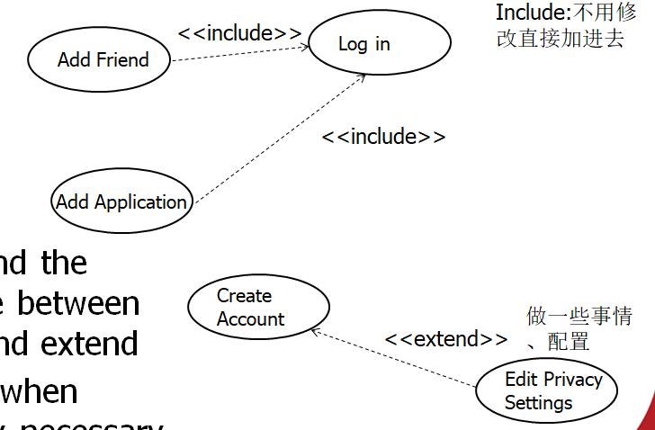

# 软件设计考点总结（按照知识点）

## 1. requirement

- a descripiton of what the system under development should do and any constraints under which it must do 系统在发展下应该做什么的描述，和它必须做的约束

- both FR 和 NFR 都可以是mandatory强制的/optional可选的

## 2. use case 及其内容的（actor）定义

- use case: a behaviour model of a system, it is a verb-noun phrase

- actor: a user or another system that interacts with our system

- system boundary

## 3. use case descriptions——scenarios

- scenatios (eg, happy day) captures what we expect to be the normal behaviour

## 4. software design 

- 定义：software design is a process by which a set of requirements is transformed into a collection of data structures and algorithms that implement the software requirements as one or more computer programs. 软件设计是过程，通过软件设计将一组需求转化为 一组 作为一个或多个计算机程序来实现软件需求的数据结构和算法。

- dependability(5)（可靠性）:  availability, reliability, safety, security, performance 可用 可靠 安全 保密 性能

- key objectives(6): correctness, robustness, flexibility, reusability, effficiency, reliability 正确 稳健 灵活 重用 高效 可信

## 5. class is abstraction, 其作用

- emphasis（强调） relevant characteristics

- suppress（抑制） other characteristics

## 6. explict architecture 的好处

- it may be used as a focus of discussion by stakeholders

- helps system analysis

- it can be reused in large scale

## 7. architectural design, abstract specification, algorithm design 的目标是什么

- architectural design 结构设计:子系统组成系统，他们的关系被识别并记录 sub-systems make up system, their relationships are identified and documented

- abstract specification 抽象规范：抽象规范定义了服务和必须运行的限制for each sub-system, an abstract specification defines the services and constrains under which it must operate

- algorithm design算法设计：用于提供服务的算法被详细具体地设计the algorithm used to provide services are designed in detail and specified

- interface design 接口设计：对于每个子系统，它与其他子系统的接口被设计并记录for each sub-system, its interface with other syb-systems is designed and documented 

- component design组件设计：服务被分配给不同的组件，组件的接口被设计services are allocated to different components, the interfaces of components are designed

- data structure design数据结构：用于系统实现的数据结构被详细设计the data structure used in system implementation are designed in detial

## 8. 关系

- **软件结构，结构设计**
  - 结构设计过程的产物是软件结构的描述：the product of architectural design process is a description of software architecture

- **算法，服务，组件**

  - The algorithm (including data structure) produces services. 算法提供服务

  - Services are allocated to different components. 服务被分配给组件

- **系统，组件，模块**

  - The system can be built by component. 系统由组件构成

  - The component can be built by module. 组件由模块构成

## 9. 架构设计的 interface model, relationship model, distribution model是什么

- interface model 界面模型：defines the services offered by each sub-system through its public interface 定义子系统通过公共接口提供的服务

- relationship model 关系模型：show relationships, (such as data flow), between the sub-systems

- distribution model 分布模型：show how sub-systems be distributed across computer 子系统如何通过计算机分布

- static structural model 静态模型：show how the sub-systems or components are to developed as separate units 子系统、组件开发成独立单元

- dynamic process model 动态过程模型：show how the system is organised into process

## 10. 软件架构的组成是啥、软件架构的element， rationale，是什么

- architecture = {elements, form, rationale}

- architecture: define system's key elements and their relationship to its structure, functionality, interactions, resulting properties 定义系统的关键元素，它与结构，功能，交互，结果性质的关系

- elements：capture system's building blocks 捕获系统的构建块 
  - 系统构建块是什么？ （？）系统中元素的主要目的是什么？ 元素提供什么系统服务？（捕捉系统构建块）

- form：captures the ways in which the system elements are organized in the architecture 捕获系统元素在体系结构中的组织方式  
  - 整体结构怎么组织？怎么组成元素完成系统任务？元素怎么分布？

- rationale:  represents the system designer's intent, assumptions, subtle choices, external constraints, selected architectural styles, design patterns, and any other information  系统设计者的意图，假设，微妙的选择，外部限制，挑选的结构风格，设计模式，其他信息
  - 为什么使用了特殊的元素？为什么以特殊的方式组合？为什么系统以给定的方式分布？——因为 rationale specifies it. 基本原理规定的

## 11. 软件架构冲突

- use large-grain components improves performance but reduce maintainability

- （可用性里）冗余组件提高可用性，但被外界接触的多了，就很难security

- localize safety-related features means more communication so degrade performance

- small-grain components improve reusability but degrade performance 

- 本地化 与安全相关的特点--- 更多的交流----> 降低性能 degrade performance

- 小粒度组件small grain 提高重用性，但降低性能

- rebundant components improves availability but less secure

## 12. 联系子系统的系统功能——by grouping togerther logically similar functions 将逻辑类似的功能聚集起来

## 13. 分解子系统——using the same principle  使用相同原理

## 14. 结构风格 优缺点

- **仓储(3,3)**

  - +: 

    - 组件可以是独立的——不用知道其他部件

    - 一个部件的改变可以传播be propagated to所有部件

    - 所有数据可以一致地管理

  - -：

    - repository is  single point of failure, problem in repository can affect whole system

    - inefficient in organizing all communication (through repository)  组织所有通信低效

    - distributing the repository (across computers) is difficult 分布仓库比较难

- **分层的软件架构 layered structure(2,3)**

  - +:

    - promotes security 安全

    - as long as interface is maintained,  it allows replacement of entire layers只要接口是维护的，允许替换整个层

  - -:

    - multiple layers hinder performance 影响性能

    - separate layers obviously( provide a clean separation between layers) is difficult  彻底分离层很难

    -  A high-level layer may have to interact directly with lower-level layers， rather than through the layer below it. 高层需要与低层直接交互，而不是通过它（高层）的下一层

- **CS(2,3)**

  - +：

    - servers can be distributed across a network 服务器可以跨过网络分布

    - general function can be available to all clients, (does not need to be implemented by all services) 通用的功能可用于所有客户，不需要由所有服务实现

  - -：

    - each server is a single point of failure. (can be affected by DDoS, server failure)

    - performance may be unpredictable 不可推测的，它取决于网络和系统  becase it depends on network and system

    - may occur management problems if servers are from（owned by） different organizations可能会发生管理问题，如果服务器来自不同组织

## 15. 使用什么结构风格

- repository：大量数据，有核心数据库，无网络 
  电脑，机器人

- client-server：多个位置访问共享数据，需要网络， 数据处理，展示信息（交互），实现逻辑
  在线买票，教务系统

- pipe and filter：工作流程process
  作业处理，稿件（manuscript）处理

- SOA service-oriented architecture：成本高，偶尔使用，业务需求不稳定
  文档转换，导航，汇率计算，同时翻译系统

- MVC：多视图多交互，未来的交互需求和数据未知
  股票分析

## 16. 挑选软件架构类型 software architecture type

- 为了系统安全：layered-structure
  multiple layers hinder performance

- 为了系统可用：structure with rebundant components (rebundant-structure/ backup-structure)

## 17. 什么情况适用什么关系

- include：include is used to extract use case fragments that are duplicated in multiple use cases，指向 selected one (必须包含的)
  在多个用例中需要，提取出来；

- extend: extend is used when a use case conditionally adds steps to another use case，指向 selecting one (正常普遍运行的)
  附加上去，不一定执行

- 图

  

## 18. 区分

- **class adapter VS object adapter**

  - class adapter: adapter adapts Adaptee by inherting from it and implementing thre Target Interface

  - object adapter: adapter inherits the Target interface and contains the Adaptee to which it forwards requests

- **Association VS aggregation VS composition**

  - association: classes are related to each other

  - aggregation: a special form of association, it implies "whole and part" relationship, one class is a part of another class

  - composition: a special form of aggregation, it shows the strong relationship between a whole class and a component class, one class is a component of another class.

- **interface VS abstract class，从 继承，实现，限制，关系来看**

  - interface：a class may implement many interfaces, cannot provide any code, static final constants only, used to describe peripheral abilities of a class
    类可以实现多个接口，不能提供代码，只有静态（全局）常量，用于描述类的次要能力

  - abstract class： a class may extend only one abstract class, can provide code, both instance and static constants are possible, defines core identity of its descendants
    一个类可能延展一个抽象类，可以提供代码，可以有实例常数，静态（全局）常数，定义后代的核心身份（如果抽象类是狗，它的派生类/实类也是狗）

